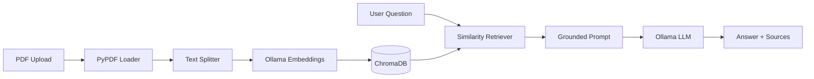

# RAG-powered PDF Q&A bot

[](https://github.com/Armiin-h/rag-powered-pdf-qa-bot/actions/workflows/ci.yml)

A retrieval-augmented generation (RAG) application that lets you upload large PDF documents and ask questions answered strictly from the document's content.

**Repository:** [github.com/Armiin-h/rag-powered-pdf-qa-bot](https://github.com/Armiin-h/rag-powered-pdf-qa-bot)

## Features

- PDF text extraction and intelligent chunking
- Vector embeddings stored in a local vector database
- Semantic search over document chunks
- LLM-powered answers grounded in retrieved context
- Simple chat interface for document Q&A
- Labeled eval set with retrieval and answer quality metrics

## Architecture



## Tech Stack

| Layer | Tool |
|-------|------|
| PDF parsing | PyPDF |
| Orchestration | LangChain |
| Embeddings & LLM | Ollama (local) |
| Vector store | ChromaDB |
| UI | Streamlit |
| Deployment | Docker Compose |
| CI | GitHub Actions |

## Prerequisites

- Python 3.11+
- [Ollama](https://ollama.com/) installed and running
- 8 GB RAM minimum (16 GB recommended)

Pull required models after installing Ollama:

```bash
ollama pull nomic-embed-text
ollama pull llama3.2
```

## Setup

```bash
python -m venv .venv
.venv\Scripts\activate        # Windows
pip install -r requirements.txt
copy .env.example .env        # adjust settings if needed
```

## Docker (recommended)

Run the full stack (Streamlit app + Ollama) with Docker Compose:

```bash
docker compose up --build -d
```

Pull models into the Ollama container (first time only):

```bash
# Linux / macOS / Git Bash
bash scripts/docker_pull_models.sh

# Windows PowerShell
.\scripts\docker_pull_models.ps1
```

Open the app at [http://localhost:8501](http://localhost:8501).

Stop the stack:

```bash
docker compose down
```

Persistent volumes keep the vector index, uploads, and downloaded models between restarts.

## Usage

### Test PDF ingestion (Day 1)

```bash
python scripts/ingest_pdf.py path\to\your\document.pdf
```

This loads the PDF, splits it into chunks, and prints ingestion stats plus a short preview.

### Index and search (Day 2)

Index a PDF into the local ChromaDB store (requires Ollama with `nomic-embed-text`):

```bash
python scripts/ingest_pdf.py path\to\your\document.pdf --index
```

Search indexed chunks:

```bash
python scripts/ingest_pdf.py --query "What is self-attention?"
```

Index and search in one run:

```bash
python scripts/ingest_pdf.py path\to\your\document.pdf --index --query "How many layers?"
```

### Ask questions (Day 3)

After indexing, ask grounded questions via the RAG chain (requires Ollama with `llama3.2`):

```bash
python scripts/ask_pdf.py "What is self-attention?"
```

Show retrieved source chunks:

```bash
python scripts/ask_pdf.py "How many encoder layers?" --show-sources
```

### Streamlit app (Day 4)

```bash
streamlit run app.py
```

Upload a PDF in the sidebar, click **Index document**, then ask questions in the chat. Retrieved source chunks appear in an expander under each answer.

### Evaluation (Day 5)

Run the labeled eval set against an indexed document (requires Ollama and an indexed PDF):

```bash
python scripts/run_eval.py
```

Save a JSON report:

```bash
python scripts/run_eval.py --output results/eval_report.json
```

Metrics reported per question:
- **Keyword recall** — fraction of expected terms found in the answer
- **Page hit rate** — whether retrieved chunks include expected source pages

Run unit tests (no Ollama required):

```bash
pytest
```

## Project Structure

```
app.py                   # Streamlit chat UI
Dockerfile               # App container image
docker-compose.yml       # App + Ollama services
.github/workflows/ci.yml # Pytest + Docker build checks
data/
  eval/
    attention_is_all_you_need.json  # Labeled eval questions
.streamlit/
  config.toml            # Theme and server defaults
src/
  config.py              # Environment-based settings
  embeddings/
    ollama_embeddings.py # Ollama embedding model factory
  evaluation/
    dataset.py           # Eval case loader
    metrics.py           # Keyword recall and page-hit scoring
    runner.py            # Batch eval over the RAG pipeline
  ingestion/
    pdf_loader.py        # PyPDF text extraction
    text_splitter.py     # Recursive character splitting
  indexing/
    pipeline.py          # PDF -> chunks -> ChromaDB pipeline
  llm/
    ollama_llm.py        # Ollama chat model factory
  rag/
    prompts.py           # Grounded QA prompt + context formatting
    chain.py             # Retriever + LCEL RAG chain
  ui/
    helpers.py           # Session keys, upload save, source labels
  vectorstore/
    chroma_store.py      # ChromaDB persistence and search
scripts/
  ingest_pdf.py          # CLI for ingestion, indexing, and search
  ask_pdf.py             # CLI for document Q&A
  run_eval.py            # CLI for RAG evaluation
  docker_pull_models.sh  # Pull Ollama models in compose stack
  docker_pull_models.ps1
tests/
  test_chroma_store.py
  test_indexing_pipeline.py
  test_prompts.py
  test_rag_chain.py
  test_ui_helpers.py
  test_eval_metrics.py
  test_eval_runner.py
```

## Project Status

| Day | Milestone | Status |
|-----|-----------|--------|
| 1 | PDF loader + text splitter | Done |
| 2 | Embeddings + ChromaDB | Done |
| 3 | Retrieval chain + prompt | Done |
| 4 | Streamlit UI | Done |
| 5 | Evaluation + architecture docs | Done |
| 6 | Docker + CI | Done |

## CI

On every push and pull request to `main`, GitHub Actions runs:

- `pytest` on Python 3.12
- `docker build` to verify the container image

## License

MIT
